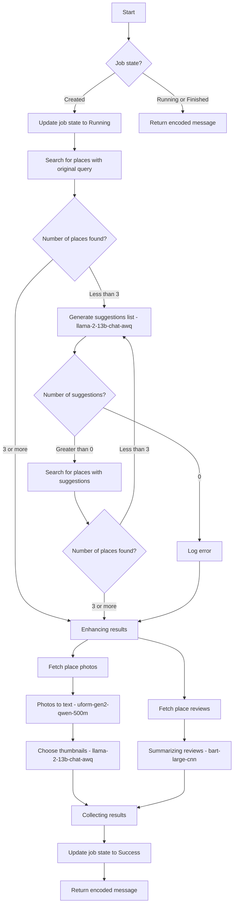

# Cule filo - AI-powered restaurant search engine

> Discover the top 3 restaurants serving your favorite food near you. Just enter your craving and location in our free AI-powered app, and start your culinary adventure today!. Our submittion to the [Cloudflare AI Challenge.](https://dev.to/devteam/join-us-for-the-cloudflare-ai-challenge-3000-in-prizes-5f99)

**Demo:** https://cule-filo.pages.dev

https://github.com/sjdonado/culefilo/assets/27580836/9c6992b4-81b7-4940-85e3-fe21dbbd41c2

**Team:** [@sjdonado](http://github.com/sjdonado) [@gjhernandez](http://github.com/gjhernandez) [@krthr](http://github.com/krthr)

## Features

1. Search your favorite meal
   

2. Real time search logs
   
   

3. See and share your results


## Design



### Functional requirements

- **Search Results Relevance:** The application should return at least one result that is relevant to the user's search query.
- **Place Descriptions Based on Reviews:** The application should generate descriptions for each place based on the available user reviews. These descriptions should provide a concise and informative summary of the place's characteristics and user experiences.
- **Contextually Relevant Image Selection:** The application should select and display an image for each place that is contextually relevant to the user's search query. This image should accurately represent the place and enhance the user's understanding of the search results.
- **Search History:** The application should maintain a history of the user's previous searches. This feature allows users to easily access and revisit their past searches, enhancing the overall user experience.

### Non Functional requirements

- **Request Completion Time:** The application should strive to complete search requests within an average time of 30 seconds or less. This ensures a smooth and responsive user experience, minimizing waiting times for search results.
- **Intuitive, Minimalist, and Responsive UI/UX:** The user interface and user experience should be designed to be intuitive, minimalist, and responsive. The application should provide a clean and clutter-free interface that is easy to navigate and understand. It should also be responsive, adapting seamlessly to different screen sizes and devices.
- **Search History Storage in Key-Value Store:** The application should store the user's search history in a key-value (KV) store. This allows for efficient retrieval and management of search history data, ensuring fast access to previous searches.

## Local setup

1. Configure secrets `.dev.vars`

```
PLACES_API_KEY={PLACES_API_KEY}
AUTOCOMPLETE_API_KEY={AUTOCOMPLETE_API_KEY}
```

2. Install dependencies

```sh
npm install
```

3. Build with Vite + run bindings with Wrangler:

```sh
npm run preview
```

## Deployment

1. Create a Cloudflare account
1. Create an application under 'Workers & Pages'
1. Checkout the master branch
1. Create KV namespace binding: `CULEFILO_KV`
1. Enable Workers AI Bindings: `AI`
1. Run `npm run deploy`
